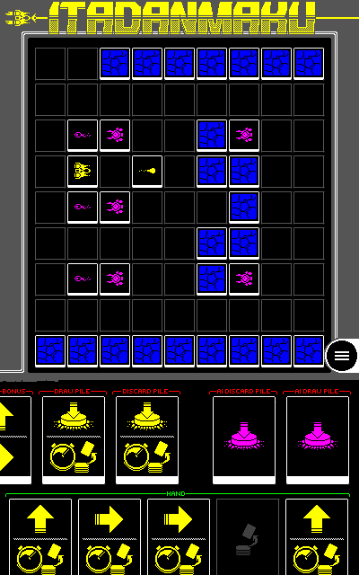
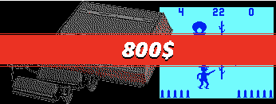
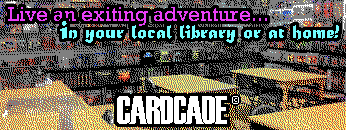
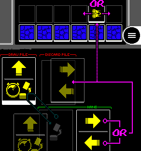
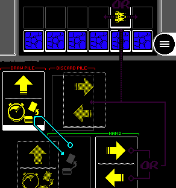
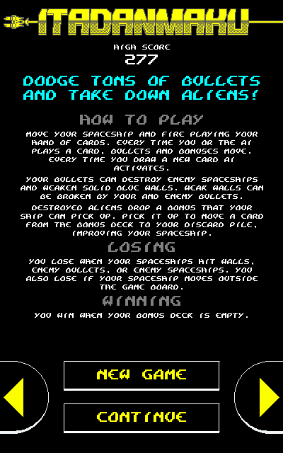

# Cardcade

    

---

    <a href="https://www.kesiev.com/cardcade/">Play the game</a>

---

**Cardcade** is an experimental opensource _digital card game system_ that offers a mechanic inspired by [deck-building games](https://en.wikipedia.org/wiki/Deck-building_game) to implement multiple types of game. The **Kesiev Norimaki's Cardcade** is an implementation of this system and a collection of games inspired by classic arcades and featuring different genres and control schemes, set in an alternative world where videogames failed to conquer the market in the 70s.

    

## Story

Videogames in 1970 failed to conquer the market due to their stressful pace, annoying psychedelic blinking lights, and exorbitant costs. 

    

Boardgames had a huge boom instead, becoming a mainstream phenomenon and attracting game designers all over the world. The Cardcade system quickly became a popular cheap way to make and distribute many of them: they are just two decks of cards and a one-sheet game manual packed in a colorful cardboard box.

    

After these 12 years, I want to prove that videogames can be better than Cardcades with this free collection of unofficial ports! Why? Because you don't have to move the cards by hand anymore, the score and the high score are automatically kept and you can play with realistic sound effects!

## How to play Cardcades

All Cardcade games are played the same way:

Click/tap one of the two halves of a card in your hand: the selected half effect is applied to the game board and the card will end in your discard pile. _(purple arrow)_

    

Click/tap an empty space of your hand: draw a new card from your deck to fill the space. _(cyan arrow)_

    

When any deck runs out of cards its discard pile is shuffled to form a new deck. Specific game rules are explained by the game selection screen.

    

---

## Why?

I've started playing a [lot of board games](https://boardgamegeek.com/collection/user/KesieV) these years, exploring as many genres as I could and I found them a lot of fun and their game design world incredibly fascinating.

Boardgame designers are limited by physical components, often with standard sizes and shapes, and must think about slim mechanics for their games since it's up to the players to remember and apply all of them. Nevertheless, they can come up with clever and innovative concepts, capable of fresh, engaging, and thrilling experiences.

In a way board games are designed as videogame were in their early days, with the hardware limited by the production costs, and the software limited by the processing power. But the connections with videogames are tighter than these.

[Dungeons and Dragons](https://en.wikipedia.org/wiki/Dungeons_%26_Dragons) inspired [Colossal Cave Adventure](https://en.wikipedia.org/wiki/Colossal_Cave_Adventure), the first interactive fiction videogame and precursor of the adventure game genre, and gave birth to the whole RPG and JRPG genre. Heck, the term [hack and slash](https://en.wikipedia.org/wiki/Hack_and_slash) comes from tabletop role-playing games!

Both board games and video games are also sharing the same influences from other forms of art (music, painting, movies, writing...) and many gameplay mechanics and concepts: there are [arena shooter](https://boardgamegeek.com/boardgame/202408/adrenaline) board games, [survival horror](https://boardgamegeek.com/boardgame/113924/zombicide) board games, [city builders](https://boardgamegeek.com/boardgame/123260/suburbia) board games and even [boss battle only](https://boardgamegeek.com/boardgame/191189/aeons-end) board games!

There also are board game _ports_ of videogames that managed to keep most of the original concepts and mechanics, like the [Fallout](https://boardgamegeek.com/boardgame/232918/fallout) board game with its story influenced by the players' decisions, the [SUPERHOT](https://boardgamegeek.com/boardgame/206156/superhot-card-game) card game that recreates its peculiar _time moves when you move_ logic in a very clever way and the [Bloodborne](https://boardgamegeek.com/boardgame/195856/bloodborne-card-game) card game that implements stamina and strategic combat combining some common mechanics in board games.

While these similarities between the board and video games may be charming, it's for the differences that you should explore board games as a videogamer.

In most of the videogames, you have to take a lot of decisions choosing from many options in a short amount of time. In many board games, it's the opposite: you've to take a few decisions with limited options in a long amount of time. How board games can still give the thrill of a battle, the safety of a cover, or a grin on your face for a well placed headshot?

Diversity is precious. Things can be done in different ways and we've to celebrate all of them. This tiny humble game is here as a memento.